# Hmpps manage adjudications API

[](https://circleci.com/gh/ministryofjustice/hmpps-manage-adjudications-api)
[](https://quay.io/repository/hmpps/hmpps-manage-adjudications-api)
[](https://manage-adjudications-api-dev.hmpps.service.justice.gov.uk/swagger-ui.html)
[](https://operations-engineering-reports.cloud-platform.service.justice.gov.uk/github_repositories#hmpps-manage-adjudications-api "Link to report")

# Features
* start a new draft adjudication
* add incident details, offence rules and roles, statements, damages, evidence and witnesses to the draft
* submit a draft, creating a reported adjudication
* review a reported adjudication
* add amend hearings and outcomes
* add / amend punishments

The frontend can be found here: <https://github.com/ministryofjustice/hmpps-manage-adjudications>

Swagger is found here <https://manage-adjudications-api-dev.hmpps.service.justice.gov.uk/swagger-ui/index.html>
# Record security

The Active-Caseload header parameter is used in conjunction with the front end, to avoid prisoner officers or 
ALO's navigating to records they are not allowed to action, it is only use for endpoints for a specific resource, 
and is not used for all reports endpoints

```
 if (listOf(reportedAdjudication.originatingAgencyId, overrideAgencyId)
        .none { it == authenticationFacade.activeCaseload }
    ) {
      throwEntityNotFoundException(chargeNumber)
    }
```

# Transfers

Transfers are handled by events within the api.  If a prisoner is transferred, a service will identify whether 
the prisoner has any transfer in a transferable state, and will mark the new agency as the override agency

```
  fun processTransferEvent(prisonerNumber: String?, agencyId: String?) {
```

# Adding an offence rule

Due to nomis synchronisation, confirm if a new nomis code is required.  The majority of work to add a new offence
is handled by the front end, based on the questions and decision paths.  

The api would require a new OffenceCode, the original mapping spreadsheet can be found at
<https://docs.google.com/spreadsheets/d/1Dx1CRSeJTjIQhDY8v4NrxYk-sUhVgbZgiW08WOo1Hk0/edit?usp_dm=false#gid=1375955278>

Paragraph descriptions will need gender based content

Offences can now be versioned, the default will be versions 1 and 2.  To add additional policy changes add a version, 
ie 3 to the defaults, and then add or exclude offences from the relevant versions.  The UI will controls the version flag

```
enum class OffenceCodes(val applicableVersions: List<Int> = listOf(1, 2)
```

```
ADULT_51_1A(applicableVersions = listOf(1), nomisCode = "51:1A", paragraph = "1(a)", uniqueOffenceCodes = listOf(1001, 1003, 1005, 1021, 1007), paragraphDescription = Descriptions.YOI_2_ADULT_1A),
ADULT_51_1A_24(applicableVersions = listOf(2), nomisCode = "51:1A (24)", paragraph = "1(a)", uniqueOffenceCodes = listOf(100124, 100324, 100524, 102124, 100724), paragraphDescription = Descriptions.YOI_2A_24_ADULT_1A_24),  
```

Bear in mind, any offence that no longer exists in the current version can be accessible from the front end
due to historic data

# Hearing outcomes and outcomes

Validation and ordering of the outcomes is important.  A hearing can have a hearing outcome, 
and generally an outcome (except for adjourn).  You can also have outcomes, without hearings. 
In addition, from a rendering perspective, referrals have referral outcomes.

The api handles the complexity for rendering on behalf of the UI.

```
fun createOutcomeHistory(hearings: MutableList<HearingDto>, outcomes: MutableList<CombinedOutcomeDto>): List<OutcomeHistoryDto> {
```

For guidance refer to the integration tests which demonstrate how the user will build 
this model and how it should be represented for the UI

# Instructions

## Running locally

For running locally against docker instances of the following services:

- run this application independently e.g. in IntelliJ

`docker-compose -f docker-compose-local.yml up`

### Running all services including this service

`docker-compose up -d`

### Tests
Before running the tests `docker-compose up` needs to be running and to have finished loading
before you start running the tests. Once done you can run the tests by running `./gradlew build`

### Running locally
`./gradlew bootRun --args='--spring.profiles.active=dev-local'`

## Architecture
High Level architecture show below 

Architecture decision records start [here](doc/architecture/decisions/0001-use-adr.md)

## Glossary

There are numerous terms and acronyms used in this codebase that aren't immediately obvious, including

| Term     | Definition                                                                                          |
|----------|-----------------------------------------------------------------------------------------------------|
| HMPPS    | HM Prison and Probation Service, and executive agency of the MoJ                                    |
| MOJ      | Ministry of Justice                                                                                 |

## Licence
[MIT License](LICENSE)
