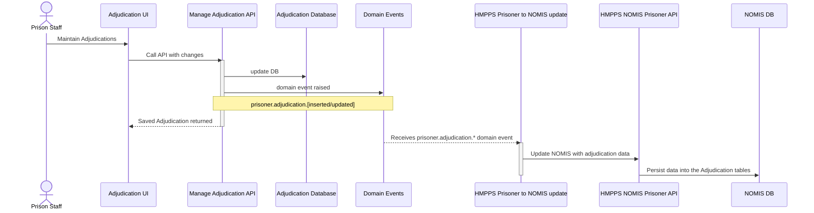
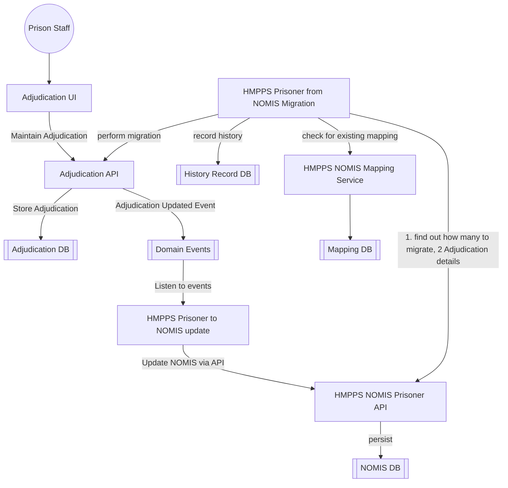

# 4. Mastering and Synchronisation of Adjudication data with NOMIS

[Next >>](9999-end.md)


Date: 2023-03-14

## Status

Accepted

## Context

This document will cover the approach for the incentive service to master incentive reference data and synchronisation this information back into NOMIS


### NOMIS synchronisation sequence
When a change is made to adjudication either a creation or update, events are be fired. The sequence of events for syncing back to NOMIS is shown below:



## Key components and their flow for Adjudication sync



#### Domain Event Types:
In all instances the domain event will contain the unique reference to the adjudication or outcome.
- prisoner.adjudication.inserted 
- prisoner.adjudication.updated
- prisoner.adjudication.outcome.inserted
- prisoner.adjudication.outcome.updated

**Example:**
```json
{
  "eventType": "prisoner.adjudication.outcome.inserted",
  "occurredAt": "2023-03-14T10:00:00",
  "version": "1.0",
  "description": "Adjudication Outcome added",
  "additionalInformation": {
    "id": "999999999"
  }
}
```


## API endpoints for sync

### Sync endpoint 
This endpoint will return all the adjudication information needed to populate NOMIS

### Migration endpoint
This endpoint will contain all the information need to populate the adjudication system with an adjudication decision and outcome


## Migration steps

1. Build API endpoints to read and write adjudication data
2. SYSCON to build one way sync service to react to adjudication data changes
3. Turn off NOMIS screens (after warning period)
4. Migrate data


## Decision
- Migration process will be trialed in pre-prod and UAT testing will be needed to check mappings have accurately represented historical data
- NOMIS screens can be turned off once all adjudications screens are complete and staff are informed to switch over.
- 


## Consequences


[Next >>](9999-end.md)
