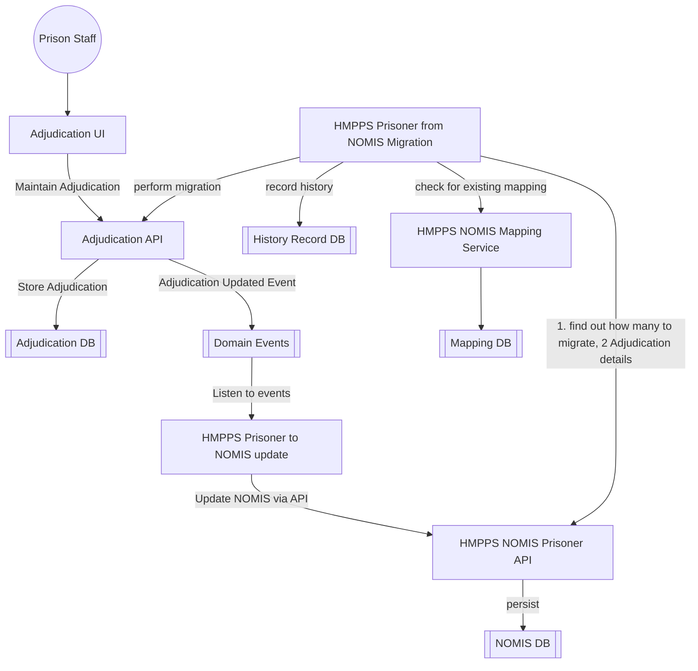

# 2. Mastering and Synchronisation of Adjudication data with NOMIS

[Next >>](0003-arch-overview.md)


Date: 2023-03-14

## Status

Accepted

## Context

This document will cover the approach for the adjudication service to master adjudication data and synchronisation this information back into NOMIS

### Moving data off NOMIS approach
Due to the rollout plan for adjudications a two-way sync and migration pattern is to be adopted.

This is because:-
- Adjudication data is prisoner centric so it cannot be sliced up into prisons
- Lower risk than big bang of turning screens off
- Data can be viewed in both systems
- We'll learn about the mapping between systems in more detail and will aid migration

Therefore, the approach will be to :-
- Keep NOMIS up to date with changes made in adjudication service
- Provide a two-way sync and keep both systems in synchronisation so that turning off access to old NOMIS screens can be done prison by prison
- Migrate all the data from NOMIS
- Once all prisons had been switched over - turn off NOMIS -> DPS sync (now 1 way only)
- All access to screen removed

Steps taken:
The Adjudication Team.
- Model the adjudication data in a new database (Done)
- Build API functionality for managing the data (Done)
- Build screens to make use of the new API (Done)
- Raise events on creation or amendments of adjudications
- Build a "sync" and "migrate" endpoints to allow NOMIS to send adjudication data

On NOMIS (syscon)
- Call adjudication "sync" endpoint when any updates where made to adjudication data in NOMIS
- Listen to events when adjudication where created in DPS and store them in NOMIS
- Migrate all the data held on adjudication in NOMIS by calling adjudication "migrate" endpoint
- Reconcile mismatches with weekly checks
- Remove all adjudication endpoints in prison-api once all services are using new adjudication API

Data is still held in NOMIS and will be maintained for reporting purposes.

### NOMIS synchronisation sequence
When a change is made to adjudication either a creation or update, events are be fired. The sequence of events for syncing back to NOMIS is shown below:


## Key components and their flow for Adjudication sync



#### Domain Event Types:
In all instances the domain event will contain the unique reference to the adjudication.
- prisoner.adjudication.created 
- prisoner.adjudication.updated

**Example:**
```json
{
  "eventType": "prisoner.adjudication.updated",
  "occurredAt": "2023-03-14T10:00:00",
  "version": "1.0",
  "description": "Adjudication Outcome added",
  "additionalInformation": {
    "id": "999999999"
  }
}
```


## API endpoints for sync

### Sync endpoint 
This endpoint will return all the adjudication information needed to populate NOMIS

`GET /an-adjudication/{id}`
```json
{
  "reportedAdjudication": {
    "adjudicationNumber": 0,
    "prisonerNumber": "G2996UX",
    "gender": "MALE",
    "bookingId": 1234,
    "incidentDetails": {
      "locationId": 0,
      "dateTimeOfIncident": "2023-03-28T12:29:35.791Z",
      "dateTimeOfDiscovery": "2023-03-28T12:29:35.791Z",
      "handoverDeadline": "2023-03-28T12:29:35.791Z"
    },
    "isYouthOffender": true,
    "incidentRole": {
      "roleCode": "25a",
      "offenceRule": {
        "paragraphNumber": "25(a)",
        "paragraphDescription": "Committed an assault"
      },
      "associatedPrisonersNumber": "G2996UX",
      "associatedPrisonersName": "G2996UX"
    },
    "offenceDetails": {
      "offenceCode": 3,
      "offenceRule": {
        "paragraphNumber": "25(a)",
        "paragraphDescription": "Committed an assault"
      },
      "victimPrisonersNumber": "G2996UX",
      "victimStaffUsername": "ABC12D",
      "victimOtherPersonsName": "Bob Hope"
    },
    "incidentStatement": {
      "statement": "string",
      "completed": true
    },
    "createdByUserId": "string",
    "createdDateTime": "2023-03-28T12:29:35.791Z",
    "status": "ACCEPTED",
    "reviewedByUserId": "string",
    "statusReason": "string",
    "statusDetails": "string",
    "damages": [
      {
        "code": "CLEANING",
        "details": "the kettle was broken",
        "reporter": "ABC12D"
      }
    ],
    "evidence": [
      {
        "code": "PHOTO",
        "identifier": "Tag number or Camera number",
        "details": "ie what does the photo describe",
        "reporter": "ABC12D"
      }
    ],
    "witnesses": [
      {
        "code": "PRISON_OFFICER",
        "firstName": "Fred",
        "lastName": "Kruger",
        "reporter": "ABC12D"
      }
    ],
    "hearings": [
      {
        "id": 0,
        "locationId": 0,
        "dateTimeOfHearing": "2023-03-28T12:29:35.791Z",
        "oicHearingType": "GOV_ADULT",
        "outcome": {
          "id": 0,
          "adjudicator": "string",
          "code": "COMPLETE",
          "reason": "LEGAL_ADVICE",
          "details": "string",
          "plea": "UNFIT"
        }
      }
    ],
    "issuingOfficer": "string",
    "dateTimeOfIssue": "2023-03-28T12:29:35.791Z",
    "disIssueHistory": [
      {
        "issuingOfficer": "string",
        "dateTimeOfIssue": "2023-03-28T12:29:35.791Z"
      }
    ],
    "dateTimeOfFirstHearing": "2023-03-28T12:29:35.791Z",
    "outcomes": [
      {
        "hearing": {
          "id": 0,
          "locationId": 0,
          "dateTimeOfHearing": "2023-03-28T12:29:35.791Z",
          "oicHearingType": "GOV_ADULT",
          "outcome": {
            "id": 0,
            "adjudicator": "string",
            "code": "COMPLETE",
            "reason": "LEGAL_ADVICE",
            "details": "string",
            "plea": "UNFIT"
          }
        },
        "outcome": {
          "outcome": {
            "id": 0,
            "code": "REFER_POLICE",
            "details": "string",
            "reason": "ANOTHER_WAY",
            "amount": 0,
            "caution": true,
            "quashedReason": "FLAWED_CASE"
          },
          "referralOutcome": {
            "id": 0,
            "code": "REFER_POLICE",
            "details": "string",
            "reason": "ANOTHER_WAY",
            "amount": 0,
            "caution": true,
            "quashedReason": "FLAWED_CASE"
          }
        }
      }
    ],
    "punishments": [
      {
        "type": "PRIVILEGE",
        "privilegeType": "CANTEEN",
        "otherPrivilege": "string",
        "stoppagePercentage": 0,
        "schedule": {
          "days": 0,
          "startDate": "2023-03-28",
          "endDate": "2023-03-28",
          "suspendedUntil": "2023-03-28"
        }
      }
    ]
  }
}
```

### Sync endpoint
This endpoint will contain all the information need to populate the adjudication system with an adjudication decision and outcome

`POST /sync`
```json
[
  *** see JSON in GET endpoint above ***
]
```

### Migration endpoint
This endpoint will contain all the information need to populate the adjudication system with an adjudication decision and outcome

`POST /migrate`
```json
[
  *** see JSON in GET endpoint above ***
]
```


## Decision
- Migration process will be trialed in pre-prod and UAT testing will be needed to check mappings have accurately represented historical data
- NOMIS screens can be turned off once all adjudications screens are complete and staff are informed to switch over.


[Next >>](0003-arch-overview.md)
