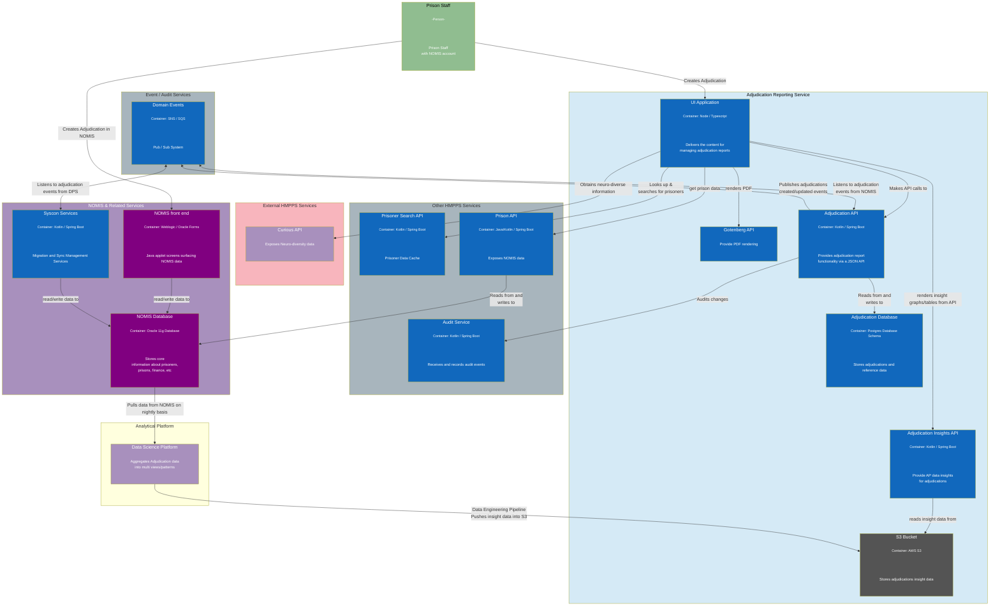
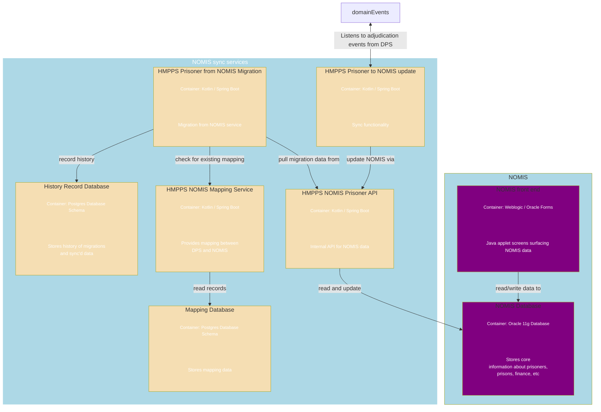

# 3. Architecture Overview
[Next >>](0004-db-schema.md)

Date: 2023-11-29

## Status

Accepted

## Context
This document illustrates the high level architecture of the adjudication service.

## Architecture Overview
Below is the high level architecture of the adjudication service.  The key components are:  
- **Prison Staff** - The users of the service
- **Adjudication UI** - The UI application that allows prison staff to manage adjudications
- **Manage Adjudication API** - The API that provides the functionality to manage adjudications
- **Adjudication Insights API** - The API that provides the adjudication insights functionality
- **S3 Bucket** - The AWS S3 bucket that stores the adjudication insight data
- **Gotenberg API** - The API that provides the PDF rendering functionality
- **Adjudication Database** - The database that stores the adjudication data
- **Domain Events** - The events that are raised when an adjudication is created or updated
- **HMPPS Prisoner to NOMIS update** - The service that syncs adjudication data back to NOMIS
- **Oracle Forms** - The legacy screens that allow prison staff to manage prisoners
- **NOMIS Database** - The legacy database that holds the data for prisoners
- **Syscon Services** - The services that provide the migration and sync functionality for NOMIS (show in more detail below)
- **Event Infra** - AWS SNS/SQS pub/sub system that provides the event functionality for HMPPS
- **Prison API** - The service that provides prisoner data from NOMIS
- **Prisoner Search API** - The service that provides the prisoner search functionality
- **Audit Service** - The service that provides the audit functionality for DPS
- **Curious API** - The API service that provides neuro-diverse information
- **Data Science Platform** - Data science platform

### Nomis to DPS Migration Services
These are maintained by Syscon and are used to migrate data from NOMIS to DPS.  The services are:
- **NOMIS Prisoner API** - The service that provides prisoner data from NOMIS
- **NOMIS Prisoner from NOMIS Migration** - The service that provides the migration functionality for NOMIS
- **NOMIS Mapping Service** - The service that provides the mapping functionality for NOMIS
- **History Record Database** - The database that stores the history of migrations and sync'd data
- **Mapping Database** - The database that stores the mapping data

[Next >>](0004-db-schema.md)
