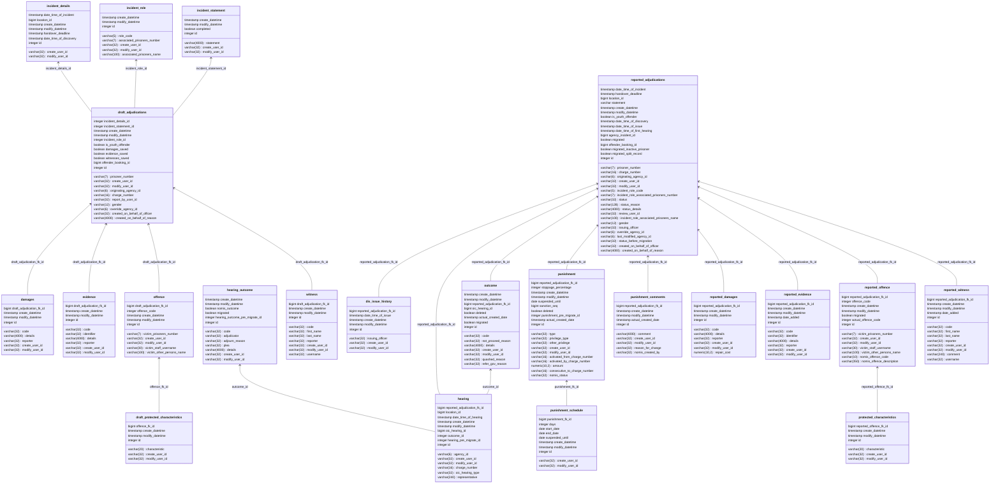

# 4. Database Schema
[Next >>](9999-end.md)

Date: 2024-04-16

## Status

Accepted

## Context
This document illustrates the database schema for adjudications

## Schema

```mermaid

classDiagram
direction BT
class damages {
   bigint draft_adjudication_fk_id
   varchar(32) code
   varchar(4000) details
   varchar(32) reporter
   varchar(32) create_user_id
   timestamp create_datetime
   varchar(32) modify_user_id
   timestamp modify_datetime
   integer id
}
class dis_issue_history {
   bigint reported_adjudication_fk_id
   varchar(32) issuing_officer
   timestamp date_time_of_issue
   varchar(32) create_user_id
   timestamp create_datetime
   varchar(32) modify_user_id
   timestamp modify_datetime
   integer id
}
class draft_adjudications {
   varchar(7) prisoner_number
   integer incident_details_id
   integer incident_statement_id
   varchar(32) create_user_id
   timestamp create_datetime
   varchar(32) modify_user_id
   timestamp modify_datetime
   varchar(6) originating_agency_id
   varchar(16) charge_number
   varchar(32) report_by_user_id
   integer incident_role_id
   boolean is_youth_offender
   boolean damages_saved
   boolean evidence_saved
   boolean witnesses_saved
   varchar(12) gender
   varchar(6) override_agency_id
   varchar(32) created_on_behalf_of_officer
   varchar(4000) created_on_behalf_of_reason
   bigint offender_booking_id
   integer id
}
class draft_protected_characteristics {
   bigint offence_fk_id
   varchar(20) characteristic
   varchar(32) create_user_id
   timestamp create_datetime
   varchar(32) modify_user_id
   timestamp modify_datetime
   integer id
}
class evidence {
   bigint draft_adjudication_fk_id
   varchar(32) code
   varchar(32) identifier
   varchar(4000) details
   varchar(32) reporter
   varchar(32) create_user_id
   timestamp create_datetime
   varchar(32) modify_user_id
   timestamp modify_datetime
   integer id
}
class hearing {
   bigint reported_adjudication_fk_id
   varchar(6) agency_id
   bigint location_id
   timestamp date_time_of_hearing
   varchar(32) create_user_id
   timestamp create_datetime
   varchar(32) modify_user_id
   timestamp modify_datetime
   varchar(16) charge_number
   bigint oic_hearing_id
   varchar(32) oic_hearing_type
   integer outcome_id
   integer hearing_pre_migrate_id
   varchar(240) representative
   integer id
}
class hearing_outcome {
   varchar(32) code
   varchar(32) adjudicator
   varchar(32) adjourn_reason
   varchar(32) plea
   varchar(4000) details
   varchar(32) create_user_id
   timestamp create_datetime
   varchar(32) modify_user_id
   timestamp modify_datetime
   boolean nomis_outcome
   boolean migrated
   integer hearing_outcome_pre_migrate_id
   integer id
}
class incident_details {
   timestamp date_time_of_incident
   bigint location_id
   varchar(32) create_user_id
   timestamp create_datetime
   varchar(32) modify_user_id
   timestamp modify_datetime
   timestamp handover_deadline
   timestamp date_time_of_discovery
   integer id
}
class incident_role {
   varchar(5) role_code
   varchar(7) associated_prisoners_number
   varchar(32) create_user_id
   timestamp create_datetime
   varchar(32) modify_user_id
   timestamp modify_datetime
   varchar(100) associated_prisoners_name
   integer id
}
class incident_statement {
   varchar(4000) statement
   varchar(32) create_user_id
   timestamp create_datetime
   varchar(32) modify_user_id
   timestamp modify_datetime
   boolean completed
   integer id
}
class offence {
   bigint draft_adjudication_fk_id
   integer offence_code
   varchar(7) victim_prisoners_number
   varchar(32) create_user_id
   timestamp create_datetime
   varchar(32) modify_user_id
   timestamp modify_datetime
   varchar(30) victim_staff_username
   varchar(100) victim_other_persons_name
   integer id
}
class outcome {
   varchar(32) code
   varchar(32) not_proceed_reason
   varchar(4000) details
   varchar(32) create_user_id
   timestamp create_datetime
   varchar(32) modify_user_id
   timestamp modify_datetime
   bigint reported_adjudication_fk_id
   varchar(32) quashed_reason
   bigint oic_hearing_id
   boolean deleted
   timestamp actual_created_date
   boolean migrated
   varchar(32) refer_gov_reason
   integer id
}
class protected_characteristics {
   bigint reported_offence_fk_id
   varchar(20) characteristic
   varchar(32) create_user_id
   timestamp create_datetime
   varchar(32) modify_user_id
   timestamp modify_datetime
   integer id
}
class punishment {
   bigint reported_adjudication_fk_id
   varchar(32) type
   varchar(32) privilege_type
   varchar(32) other_privilege
   integer stoppage_percentage
   varchar(32) create_user_id
   timestamp create_datetime
   varchar(32) modify_user_id
   timestamp modify_datetime
   varchar(16) activated_from_charge_number
   varchar(16) activated_by_charge_number
   date suspended_until
   bigint sanction_seq
   numeric(10,2) amount
   boolean deleted
   varchar(16) consecutive_to_charge_number
   varchar(32) nomis_status
   integer punishment_pre_migrate_id
   timestamp actual_created_date
   integer id
}
class punishment_comments {
   bigint reported_adjudication_fk_id
   varchar(4000) comment
   varchar(32) create_user_id
   timestamp create_datetime
   varchar(32) modify_user_id
   timestamp modify_datetime
   varchar(32) reason_for_change
   varchar(32) nomis_created_by
   timestamp actual_created_date
   integer id
}
class punishment_schedule {
   bigint punishment_fk_id
   integer days
   date start_date
   date end_date
   date suspended_until
   varchar(32) create_user_id
   timestamp create_datetime
   varchar(32) modify_user_id
   timestamp modify_datetime
   integer id
}
class reported_adjudications {
   varchar(7) prisoner_number
   varchar(16) charge_number
   varchar(6) originating_agency_id
   timestamp date_time_of_incident
   timestamp handover_deadline
   bigint location_id
   varchar statement
   varchar(32) create_user_id
   timestamp create_datetime
   varchar(32) modify_user_id
   timestamp modify_datetime
   varchar(5) incident_role_code
   varchar(7) incident_role_associated_prisoners_number
   varchar(32) status
   varchar(128) status_reason
   varchar(4000) status_details
   boolean is_youth_offender
   varchar(32) review_user_id
   varchar(100) incident_role_associated_prisoners_name
   timestamp date_time_of_discovery
   varchar(12) gender
   varchar(32) issuing_officer
   timestamp date_time_of_issue
   timestamp date_time_of_first_hearing
   varchar(6) override_agency_id
   varchar(6) last_modified_agency_id
   bigint agency_incident_id
   boolean migrated
   bigint offender_booking_id
   varchar(32) status_before_migration
   varchar(32) created_on_behalf_of_officer
   varchar(4000) created_on_behalf_of_reason
   boolean migrated_inactive_prisoner
   boolean migrated_split_record
   integer id
}
class reported_damages {
   bigint reported_adjudication_fk_id
   varchar(32) code
   varchar(4000) details
   varchar(32) reporter
   varchar(32) create_user_id
   timestamp create_datetime
   varchar(32) modify_user_id
   timestamp modify_datetime
   numeric(10,2) repair_cost
   integer id
}
class reported_evidence {
   bigint reported_adjudication_fk_id
   varchar(32) code
   varchar(32) identifier
   varchar(4000) details
   varchar(32) reporter
   varchar(32) create_user_id
   timestamp create_datetime
   varchar(32) modify_user_id
   timestamp modify_datetime
   timestamp date_added
   integer id
}
class reported_offence {
   bigint reported_adjudication_fk_id
   integer offence_code
   varchar(7) victim_prisoners_number
   varchar(32) create_user_id
   timestamp create_datetime
   varchar(32) modify_user_id
   timestamp modify_datetime
   varchar(30) victim_staff_username
   varchar(100) victim_other_persons_name
   varchar(10) nomis_offence_code
   varchar(350) nomis_offence_description
   boolean migrated
   integer actual_offence_code
   integer id
}
class reported_witness {
   bigint reported_adjudication_fk_id
   varchar(32) code
   varchar(32) first_name
   varchar(32) last_name
   varchar(32) reporter
   varchar(32) create_user_id
   timestamp create_datetime
   varchar(32) modify_user_id
   timestamp modify_datetime
   varchar(240) comment
   varchar(32) username
   timestamp date_added
   integer id
}
class witness {
   bigint draft_adjudication_fk_id
   varchar(32) code
   varchar(32) first_name
   varchar(32) last_name
   varchar(32) reporter
   varchar(32) create_user_id
   timestamp create_datetime
   varchar(32) modify_user_id
   timestamp modify_datetime
   varchar(32) username
   integer id
}

damages  -->  draft_adjudications : draft_adjudication_fk_id
dis_issue_history  -->  reported_adjudications : reported_adjudication_fk_id
draft_adjudications  -->  incident_details : incident_details_id
draft_adjudications  -->  incident_role : incident_role_id
draft_adjudications  -->  incident_statement : incident_statement_id
draft_protected_characteristics  -->  offence : offence_fk_id
evidence  -->  draft_adjudications : draft_adjudication_fk_id
hearing  -->  hearing_outcome : outcome_id
hearing  -->  outcome : outcome_id
hearing  -->  reported_adjudications : reported_adjudication_fk_id
offence  -->  draft_adjudications : draft_adjudication_fk_id
outcome  -->  reported_adjudications : reported_adjudication_fk_id
protected_characteristics  -->  reported_offence : reported_offence_fk_id
punishment  -->  reported_adjudications : reported_adjudication_fk_id
punishment_comments  -->  reported_adjudications : reported_adjudication_fk_id
punishment_schedule  -->  punishment : punishment_fk_id
reported_damages  -->  reported_adjudications : reported_adjudication_fk_id
reported_evidence  -->  reported_adjudications : reported_adjudication_fk_id
reported_offence  -->  reported_adjudications : reported_adjudication_fk_id
reported_witness  -->  reported_adjudications : reported_adjudication_fk_id
witness  -->  draft_adjudications : draft_adjudication_fk_id
```

[Next >>](9999-end.md)